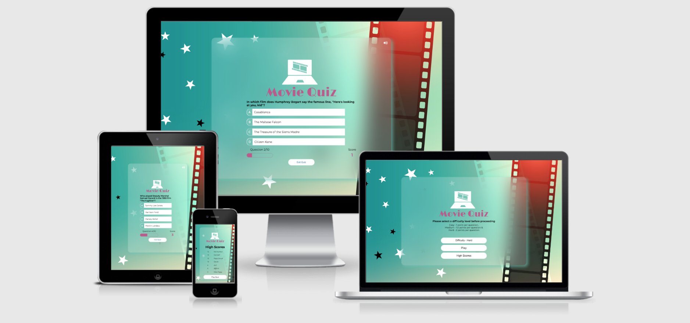
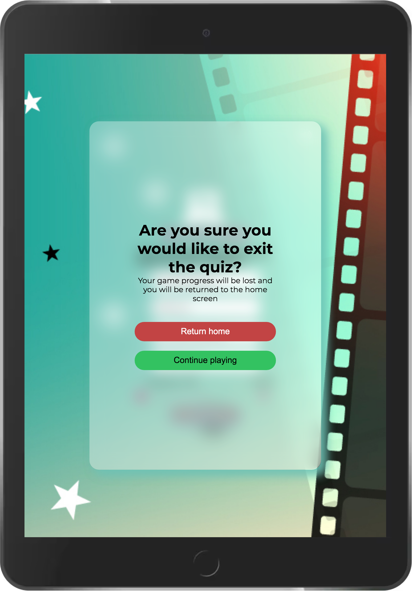

# Movie Questions

Welcome, this is my movie question site.
The goal of the site is to provide a fun quiz game with 10 questions, with an option to choose a difficulty level which will vary the points per question. The questions are are pulled from the site [Open Trivia (API) Database](https://opentdb.com/api_config.php)

Thank you for visiting [my project!](https://dkitley1975.github.io/movie-quiz/)

## Features

- __Favicons__

  

  Favicons have been added to include the favicon within the address bar, as the bookmark icon and the bookmark icon on apple devices.

- __The Welcome Page__

  - The welcome page displays and image in the background with a glass style container floating above. This container blurs the image below, this 'glass' container is used through out the quiz app for all the sections.
  - The container contains the logo with brief instructions explaining the point scoring system.
  - The buttons are self-explanatory.
    - A button with a dropdown list for the difficulty level.
    - A button to play the game, and a button, and
    - A button to view the high scores.

The points values are input within the Javascript file which updates the text on the welcome page, this ensures that if the scores are updated, the welcome page points section does not require updating manually.
  
  

- __The Level Selection Process__

  A self intuitive level selection process was used for the game which defaults to easy.
  - The obvious difficulty levels are:
    - Easy.
    - Medium, and
    - Hard.
  
  

-__High Scores Section__
This section has a table created from the users local storage, when first opening the local storage is populated with some example names and scores from the Javascript file, this ensures that the high scores page isn't blank when opening.
There is also included a button to return to the home screen.
  
  
  
- __The Quiz Section__

  - The quiz page included the logo at the top.
  - The questions are populated from the randomly from the questions fetched from [Open Trivia (API) Database](https://opentdb.com/api_config.php). These questions are obtained according to the difficulty level selected by the user. Instead of just 10 questions fetched from the API there is a factor of 5 (again determined within the Javascript file) to help the randomness to the questions. on testing if only 10 questions are fetched from the API it was the same 10 questions fetched each time, spoiling the quiz game play on any repeat attempts.
  - When an answer is selected the question either lights up Red for incorrect or green for correct.
  - When an answer is selected there is a sound, either a buzz or a ding to indicate if the answer was incorrect or correct, this feature is able to be turned off or on by the mute/play button at the bottom right of the play screen.
  - Beneath the answers there is a progress section, this has a question counter with a progress bar, the progress bar has rounded corners with the internal bar being flat on the right until the final question when this too becomes rounded.
  - There is also the scoring on the right, this is increased each time a question is answered correctly according to the point value indicated by the difficulty level selected by the user.
  - Just encase the user becomes board during the game play (although I couldn't possible see why they would) There is an exit game button. This overlays an exit screen over the quiz with a warning that exiting at this time will loose the current quiz session and score, with two buttons.
    - A green button to continue back to the quiz, and
    - A red button to return to the welcome screen

  
  
- __A Guide to Fundamental Yoga Poses section__

  - This section is to demonstrate to the user 9 fundamental yoga poses, each pose has a set of step by step instructions, these short videos are set to not autoplay but have controls visible and will automatically loop once played, so the user and watch as they read the guide instead of continually pressing play.
  
  
  
- __Yoga Exercise Videos section__

  - This section is to let the user watch a small selection of videos with yoga exercise routines and meditation routines.
  - The videos are not set to autoplay as these are longer videos and will only begin downloading as the user begins to play, they are also set at mute.
  - The videos also have a poster image set.

  
  
- __Newsletter Sign Up Section__

  - This section will allow the user to sign up to the Yoga Centric Monthly Newsletter. The user will be asked to submit their full name and email address, the form is validated within html5 and after submitting the form is hidden and replaced with a thank you form message.

  
  

- __The Footer__

  - The footer section includes links to the relevant social media sites for Yoga Centric. The links will open to a new tab to allow easy navigation for the user.
  - The footer is valuable to the user as it encourages them to keep connected via social media.

  

- __Quotation Blocks__

  - There are two additional quotation blocks with full width images within the site, these help to separate the sections in to clear section breaks.
  
  
  

### Typeface

In order to find appropriate typefaces for my website, I have visited [Google Fonts](https://fonts.google.com/ "Google Fonts") to explore the various options.
For the main body text I have chosen the google typeface Source Sans Pro. This is a visually appealing and easy to read typeface.
For the headings I wanted a slightly different typeface. I explored for headings on [Fontpair](https://www.fontpair.co/ "Font Pair") and choose the google font Lato.
This font is visually appealing and pairs well with source sans pro.

  

### Colours

I based my color scheme on a pallet devised around beach landscapes using the crams of the sand to help create a calm, natural feeling.

- rgb(254, 232, 223) This color is called Champagne Pink - will be used as  a background colour and will be used with a .6 transparency.
- rgb(222, 183, 152) This color is called Tumbleweed - to be used as a contrast tot the background colour.
- rgb(153, 95, 58) This color is a called Brown Sugar - This is to be used as my header colours.
- rgba(100, 64, 41) This color is a called Van Dyke Brown - This is to be used as my colour to over lay the Champagne Pink.
- The main colour of my text is to be black.

I have used to contract checker on Coolors in order to make sure that the contract is sufficient.
This way my content will be easily readable.
After testing my colour scheme on the live site I amended the text in the quotation blocks to black to help improve the colour contract between the background colour transparancy and the text.

### Wire Frames

My wire frames can be found here:

- [Desktop/Tablet wireframe](./docs/wireframes/tablet-wireframe.png)

- [Mobile wireframe](./docs/wireframes/mobile-wireframe.png)

### Features Left to Implement

- A HTML and CSS only Navigation bar - rather than relying on javascript to close the menu after a click.
- To have the current section show active in the navigation bar.

## Testing

- **Navigation Bar**
  - To test the navigation bar, I have click all the links to ensure they all link to the relevant sections and they all works as expected.
  - I have also opened the website in various browsers (safari, google chrome, mozilla firefox, Edge) to make sure it works on all browsers and devices.
  - I adjusted the padding on each section to ensure the h1 text at the top of each section was not covered by the navigation bar when the nav links were followed.
  - I checked the nav bar menu changed to the hamburger menu on small devices.

- **Foundation Poses**
  - To test the foundation poses, I have played all the videos to ensure play and loop as expected.
  - I have also opened the website in various browsers (safari, google chrome, mozilla firefox, Edge) to make ensure they play on all browsers and devices.
  - These were initially gifs which I replaced  with the mp4 versions. I added the video controls and stopped the videos from auto playing as this looked too busy when scrolling through.
  - I have opened the site at various sizes to ensure the grid adjusts at the required break points.  

- **Exercise Videos**
  - To test the exercise videos, I have played all the videos to ensure play and loop as expected.
  - I have also opened the website in various browsers (safari, google chrome, mozilla firefox, Edge) to make ensure they play on all browsers and devices.
  - These were initially added as embedded YouTube iframes. These however gave cookie errors displayed within the developer tools. I choose to replace the iframe with a link to the downloaded video to circumnavigate the cookie issue.
  
- **Newsletter Sign up**
  - To test the newsletter sign up, I have signed up for the yoga newsletter multiple times ensuring that it works as expected and after sign up displays the thank you for signing up message.
  - I have also opened the website in various browsers (safari, google chrome, mozilla firefox, Edge) to make ensure the sign up form displays as expected.

- **Footer Social Icons**
  - Links - these were checked to ensure they open open in the correct platforms, on mobile testing they opened up the appropriate application. On desktop they opened the correct website.
  - Social Font Awesome Icons - Whilst checking the site across multiple platforms, I noticed a GET fa-brands-400.woff2 error had accured. When cross checking on different browsers the icons also disappeared. I rolled back the site a couple of iterations to check my code and the error continued, after readding the icons to the site the issue remained. The issue was also appearing on other random websites, after this I decide to self host the icons and the error has since stopped.

### Chrome Lighthouse Report

  I tested the [live site](https://dkitley1975.github.io/yoga-centric)
  with the lighthouse extension, this showed a few performance improvements were required, I reduced the size of the images to achieve this.

  
  [See Report](https://googlechrome.github.io/lighthouse/viewer/?psiurl=https%3A%2F%2Fdkitley1975.github.io%2Fyoga-centric%2F%23hero-container&strategy=desktop&category=performance&category=accessibility&category=best-practices&category=seo&category=pwa&utm_source=lh-chrome-ext#pwa)

### Silk Tide

  I used this to give a test of a simulated screen reader on the site. I made some alterations to the ARIA attributes and tested the site again until it read the required sections in a explanatory way.

### Validator Testing

- HTML - No errors were returned when passing through the official [W3C validator](https://validator.w3.org/nu/?doc=https%3A%2F%2Fdkitley1975.github.io%2Fyoga-centric%2F)
- CSS -  No errors were found when passing through the official [(Jigsaw) validator](https://jigsaw.w3.org/css-validator/validator?uri=https%3A%2F%2Fdkitley1975.github.io%2Fyoga-centric%2F&profile=css3svg&usermedium=all&warning=1&vextwarning=&lang=en)

### Unfixed Bugs

No Known bugs at present.

## Deployment

This project was deployed via GitHub by executing the following steps.
After writing the code, committing and pushing it to GitHub:

1. Navigate to the repository on github and click **Settings**.
2. From there, go to the **Source section** within the Github Pages section.
3. Select **master branch** on the dropdown menu, and click save.
4. Now the website is [live here](https://dkitley1975.github.io/yoga-centric)
5. Any time commits and pushes are sent to Github, the Github Pages site should update shortly after.

To run the project locally:

1. Click the **green Clone or Download button** on the Github Repository
2. Using the **Clone with HTTPS option**, copy the link displayed.
3. Open your IDE, and ensure the Git Terminal is open.
4. Change the working directory to the location where the cloned directory is to go.
5. Use the **"git clone" command** and paste the [url](https://github.com/dkitley1975/yoga-centric.git) copied in the second step.

## Credits

- The Newsletter sign up section uses Email.js to implement the sending of the emails - Instead of having the javascript run totally within the html, I created a new .js file and placed the code in there. referencing this external file. I added additional code to this to add a 'display = "none"' to the original Newsletter Sign-up form and display = "block" to the Thank you form.
- I wanted to incorporate on the mobile Navigation menu the ability to have it automatically close after selecting a link. I found a [tutorial](https://dev.to/devggaurav/let-s-build-a-responsive-navbar-and-hamburger-menu-using-html-css-and-javascript-4gci) which suited this purpose. This tutorial was followed and the code was adapted for my own purposes and styled to match my site.
- The instructions for the Yoga poses was taken from [healthline.com](https://www.healthline.com/health/fitness-exercises/definitive-guide-to-yoga#-the-basics-and-foundation).

Rather than attempt to rewrite these instructions It was better to use the verbatim, as trying to rewrite them would most likely would cause some one a injury from following unsafe instructions.

- Favicons were created at [favicon.io](https://favicon.io/favicon-generator)

Rather than creating my own this was a simple and quick way to create the simple icons and webmanifest code.

### Media

- The icons in the footer were taken from [Font Awesome](https://fontawesome.com/)
- The photos used on the throughout the site were all from [Freepix](www.freepik.com)
- The animated gifs used for the Foundation Poses were taken [Gfycat](gfycat.com)
- Videos (*These were initially added as embedded YouTube iframes. This however gave cookie errors displayed within the developer tools. I choose to replace the iframe with a link to the downloaded video to circumnavigate the cookie issue, and just incase the Youtube video was removed this would result in a broken link within this project.*)
  - [The Wake Up & Flow Yoga | YogaFit Retreats - Lindsay Jay video](https://youtu.be/bTs73IH7Ycw)
  - [Happiness & Gratitude Meditation - Lindsay Jay video](https://youtu.be/nSISnimEq30)
  - [Lindsay Jay Yoga video](https://youtu.be/KarBeaitMNs)

### What I've learnt from mistakes made during  this first project

- Commit messages
  - I've learnt I need to make clearer and uniformed messages.  My messages have been without any naming convention framework. I have taken action to correct this in my future projects.
  - Not making enough commits. I found I became carried away during coding and forgot to commit often enough, thus my commits contained too many changes to code between commits.
- Mobile first
  - On this project I should of coded mobile first, changing the code to mobile first after the fact reduced the amount of code and reduced the amount of media queries. Although this could also be because I had become more familiar with my project and code during this time.
- Learn to let it go  
  - I have spent far too long tweaking, with no real substantial gain to the site.

Well thanks for reading all the way to the bottom, and for visiting this [my first project](https://dkitley1975.github.io/yoga-centric/)
