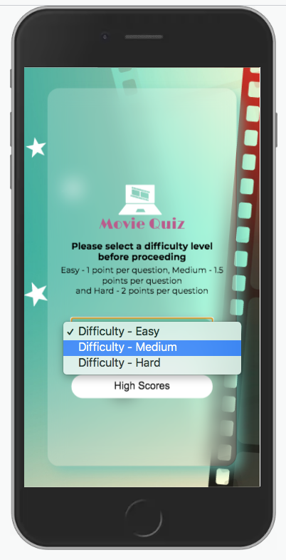
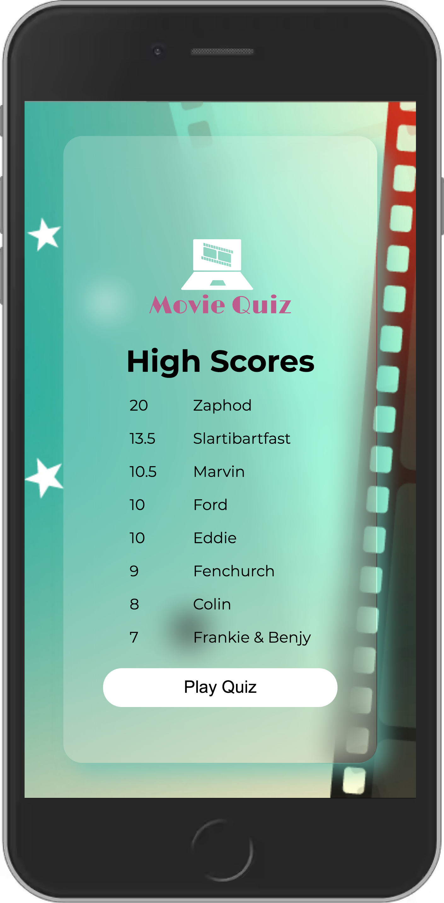
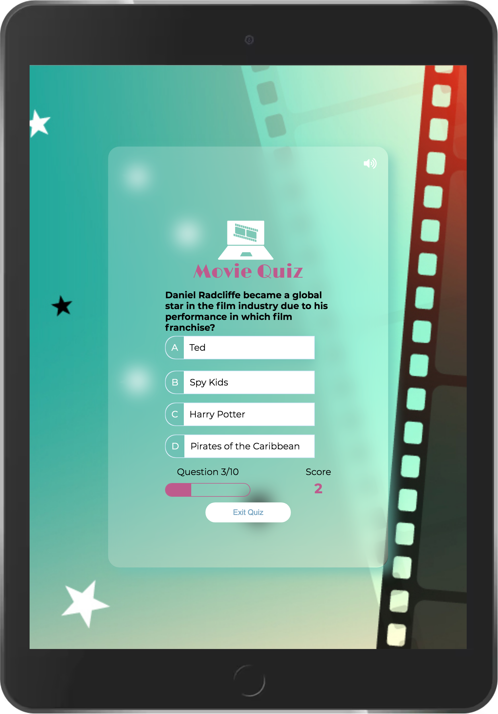
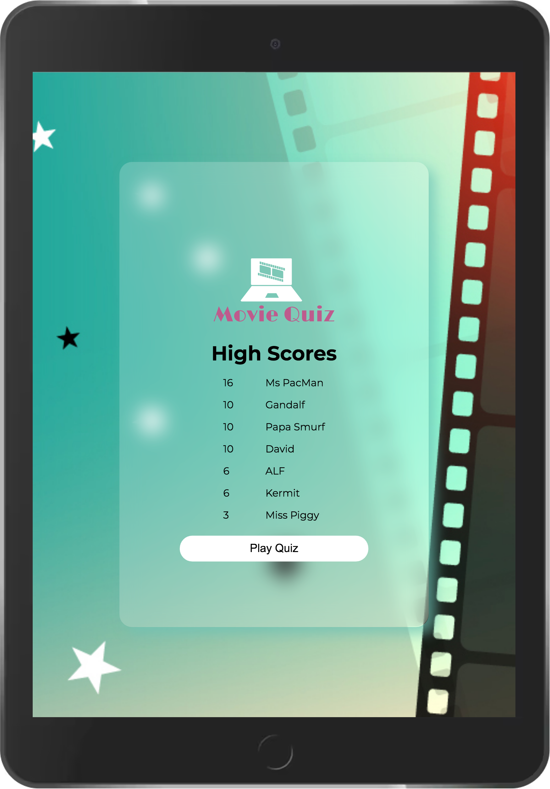
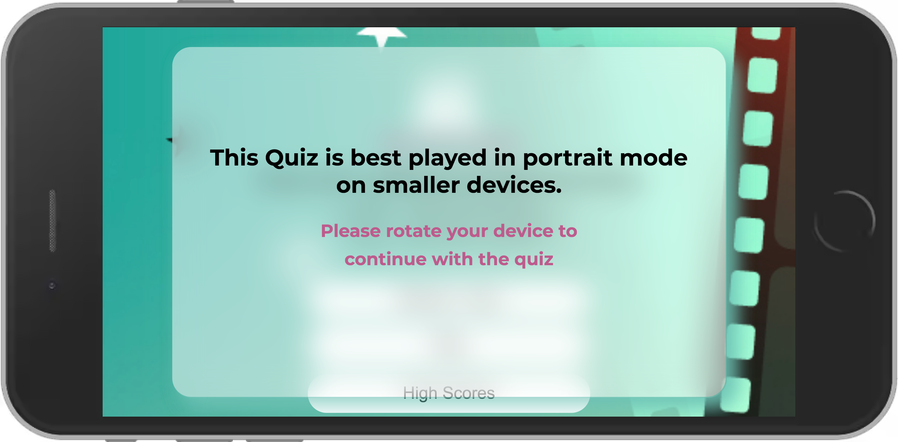

# Movie Questions

Welcome, this is my movie question site.
The goal of the site is to provide a fun quiz game with 10 questions, with an option to choose a difficulty level which will vary the points per question. These questions are fetched from [Open Trivia (API) Database](https://opentdb.com/api_config.php)

Thank you for visiting [my project!](https://dkitley1975.github.io/movie-quiz/)

- [Movie Questions](#movie-questions)
  - [Project Overview](#project-overview)
  - [Features](#features)
    - [Typeface](#typeface)
    - [Colours](#colours)
    - [Sounds](#sounds)
    - [Offline & insufficient Height messages](#offline--insufficient-height-messages)
    - [Features Left to Implement](#features-left-to-implement)
  - [Testing](#testing)
    - [Chrome Lighthouse Report](#chrome-lighthouse-report)
    - [Validator Testing](#validator-testing)
    - [Unfixed Bugs](#unfixed-bugs)
  - [Deployment](#deployment)
  - [Credits](#credits)
    - [Media](#media)
    - [Special Thanks](#special-thanks)

## Project Overview

This Movie Quiz is a website that aims to provide a fun challenge for the end-user with a quiz. This creation of this site is part of my Portfolio Project 2 for Code Institute. The initial aim of the site is to show my newly developing knowledge of JavaScript whilst continuing to develop my HTML and CSS.

__Site User Goals:__

- I want to be able to an online quiz to test my knowledge of movies.
- I want to be able to select a difficulty level for the quiz.
- I want to see my progress whilst playing the quiz game.
- I want to track my score during the quiz game, with a visualisation of how many points I have accrued.
- I want to see how many questions I have answered and how many are left.
- I want to view my final score after the quiz game has ended and to be able to save my score if I wish.
- I want to be able to replay the quiz game without repeating the same questions each time.
- I want to be able to view the high scores table of my previously saved scores.
- I want to have the option to quit the quiz game before finishing it.

 __Site Owner Goals:__

- I want to provide a challenging quiz to entertain online users.
- I want to enable the user to easily navigate the site and game without encountering any difficulty.
- I want the user to return and replay the quiz.
- I want the user to record their high scores to give the incentive to return to replay the game to improve the score.
- I want the user to be able to select a difficulty level for the questions.
- I want the difficulty of the questions to reflect on the value of points per question.

## Features

- __Favicons__

  

  Favicons have been added to include the favicon within the address bar, as the bookmark icon and the bookmark icon on apple devices.

- __The Welcome Page__

- The welcome page displays an image in the background with a glass style container floating above. This container blurs the image below, the 'glass' container is used throughout the quiz app for all the sections.
- The container contains the logo with brief instructions explaining the point scoring system.
  - The buttons are self-explanatory.
  - A button with a dropdown list for the difficulty level.
  - A button to play the game, and a button, and
  - A button to view the high scores.

The points values are input within the Javascript file which updates the text on the welcome page. This ensures that if the scores are updated, from within the javascript file, the welcome page points section does not require updating manually.
  
  

- __The Level Selection Process__

  A self intuitive level selection process was used for the game which defaults to easy.
  - The obvious difficulty levels added were:
    - Easy,
    - Medium, and
    - Hard.
  
  

- __High Scores Section__
This section has a table created from the user's session storage, when first opening the session storage is populated with some example names and scores from the Javascript file, this ensures that the high scores page isn't blank when first opening.
There is also included on this page a button to return to the home screen.
There are 6 sample high scores added to the storage initially, the score values are created randomly using the point values and the total amount of questions to be asked within the quiz. This is calculated twice for the Hard, Medium and Easy values
    `Math.floor(Math.random() * (SetQtyOfQuestions + 1)) * pointsPerCorrectAnswerHard`
  
  
  
- __The Quiz Section__

  - The quiz page included the logo at the top.
  - The questions are populated randomly from the questions fetched from [Open Trivia (API) Database](https://opentdb.com/api_config.php). These questions are obtained according to the difficulty level selected by the user. Instead of just 10 questions fetched from the API there is a factor of 5 (again determined within the Javascript file) to help the randomness to the questions. on testing if only 10 questions are fetched from the API it was the same 10 questions fetched each time, spoiling the quiz gameplay on any repeat attempts.
  - When an answer is selected the question either lights up Red for incorrect or green for correct.
  - When an answer is selected there is a sound, either a buzz or a ding to indicate if the answer was incorrect or correct, this feature is able to be turned off or on by the mute/play button at the bottom right of the play screen.
  - Beneath the answers there is a progress section, this has a question counter with a progress bar, the progress bar has rounded corners with the internal bar being flat on the right until the final question when this too becomes rounded.
  - There is also the scoring on the right, this is increased each time a question is answered correctly according to the point value indicated by the difficulty level selected by the user.
  - Just encase the user becomes bored during the gameplay (although I couldn't possibly see why they would) There is an exit game button. This overlays an exit screen over the quiz with a warning that exiting at this time will lose the current quiz session and score, with two buttons.
    - A green button to continue back to the quiz, and
    - A red button to return to the welcome screen

  
  
- __Submitting High Scores__

  - After completing the quiz, the user has an option to save their score and play again or not to save and play again.
  - The score is submitted and only the top 8 scores are retained. This retention value is easily amended within the top section of the Javascript file.
  
  
  
  
### Typeface

In order to find appropriate typefaces for my website, I have visited [Google Fonts](https://fonts.google.com/ "Google Fonts") to explore the various options.
For the main body text, I have chosen the google typeface Montserrat. This is a visually appealing and easy to read typeface.
For the headings, I wanted a slightly different typeface. I explored for headings and choose the google font Limelight.
This font is visually appealing and pairs well with the typeface Montserrat.

  

### Colours

I based my colour scheme on a pallet devised around the primary red and green colours for the correct and incorrect indicators on the quiz answers, these primary colours matched well with the background image chosen to display throughout the app.

- #33C261 This colour is the Green I chose to indicate a correct answer within the quiz.
- #C24444 This colour is the Red I chose to indicate an incorrect answer within the quiz.
- #6EC2B5 is a pale Bue/Green which goes well with the background image.
- #78A5C2 is a Blue which goes well with the background colour and contrasts well against the Red and Green.
- #BE5B8D is a dark Pink which stands out well against the other colours but compliments them all well, this colour is used as the logo colour and progress bar and current score.
- The main colour of my text is to be black.

I have used to contract checker on Coolors to make sure that the contract is sufficient.
This way my content will be easily readable.

### Sounds

I have implemented a sound to indicate a correct and an incorrect answer, I have added a mute icon to the quiz container to allow the user to select if they wish to hear the confirmation sounds.
The user selection is also added into the session storage, this way at the end of the game and the user plays again, the mute/play sound status is recalled from the storage and is continued to implemented within the gameplay.

### Offline & insufficient Height messages

- I have added a message that covers over the welcome page if:
  - **Offline** - Initially if the user appears to be offline. This function checks if the user appears to be offline and displays a message asking for the user to refresh once they are connected. This Function envelopes the fetch API elements and the Quiz start sections within the javascript.
  

  - **Height of the screen** - if the height of the screen is of insufficient size to display the quiz. The site displays a message asking the user to rotate their screen to continue playing the quiz.
  

### Features Left to Implement

- If the number of high scores reaches the maximum allowed, then check the user score against the lowest of the high scores. If the score is lower then only show the user score and previous high scores. Hiding the 'enter a username' and 'submit high score button', replacing them with a try again message.

## Testing

### Chrome Lighthouse Report

  I tested the [live site](dkitley1975.github.io/movie-quiz/)
  with the lighthouse extension, this showed no value under 99.

  
  [See Report](https://googlechrome.github.io/lighthouse/viewer/?psiurl=https%3A%2F%2Fdkitley1975.github.io%2Fmovie-quiz%2F&strategy=desktop&category=performance&category=accessibility&category=best-practices&category=seo&category=pwa&utm_source=lh-chrome-ext#pwa)

### Validator Testing

- **HTML** - No errors or warnings were returned when passing through the official [W3C validator](https://validator.w3.org/nu/?doc=https%3A%2F%2Fdkitley1975.github.io%2Fmovie-quiz%2Findex.html)
- **CSS** -  Two errors were found when passing through the official [(Jigsaw) validator](https://jigsaw.w3.org/css-validator/validator?uri=https%3A%2F%2Fdkitley1975.github.io%2Fmovie-quiz&profile=css3svg&usermedium=all&warning=1&vextwarning=&lang=en), these both retain to the backdrop-filter property.
- **Javascript** - No errors or warnings are shown when adding the code to this site. [(JSHint.com) validator](https://jshint.com/)

### Unfixed Bugs

Whilst testing within the developer tools within the web browsers no issues were identified visually, but whilst testing on an iphone the address bar and navigation bar on Safari and Chrome interfered with the margins and the centralisation of the container. This didn't replicate in Edge or Firefox. I reached out for Tutor support to help resolve this issue and unfortunately the issue was unable to be fixed, at this time. I did increase the margin and padding to help reduce the problem, whilst ensuring the content fit within the screen.
It is noticed that if the user adds the bookmark to the home screen when the web page is opened the toolbars are hidden by request and the page is centralized and has no issues.

An additional issue is the ios button styling, which I haven't as yet been able to style in the way I would like.

## Deployment

This project was deployed via GitHub by executing the following steps.
After writing the code, committing and pushing it to GitHub:

1. Navigate to the repository on github and click **Settings**.
2. From there, go to the **Source section** within the Github Pages section.
3. Select **master branch** on the dropdown menu, and click save.
4. Now the website is [live here](https://dkitley1975.github.io/movie-quiz/)
5. Any time commits and pushes are sent to Github, the Github Pages site should update shortly after.

To run the project locally:

1. Click the **green Clone or Download button** on the Github Repository
2. Using the **Clone with HTTPS option**, copy the link displayed.
3. Open your IDE, and ensure the Git Terminal is open.
4. Change the working directory to the location where the cloned directory is to go.
5. Use the **"git clone" command** and paste the [url](https://github.com/dkitley1975/movie-quiz.git) copied in the second step.

## Credits

  I watched multiple YouTube videos on creating quizzes, after watching a few, most of these all followed the same approach, down to the order of creation and colours used within the site. I had previously followed [Build a Quiz App by James Q Quick](https://www.youtube.com/watch?v=u98ROZjBWy8&list=PLDlWc9AfQBfZIkdVaOQXi1tizJeNJipEx) and this was used as the initial inspiration and valued practice for this project. The ideas practised whilst watching this tutorial have been heavily built on and added to.

### Media

- The loading spinner was adapted from [loading.io](https://loading.io/css/)
- The icons for the audio mute and play are from [Font Awesome](https://fontawesome.com/)
- The Correct and Incorrect SFX are from [My Instants](https://www.myinstants.com/)
- Mock up graphic from [Am I Responsive](http://ami.responsivedesign.is/).

### Special Thanks

Special thanks to my mentor Simen Daehlin. Without his persuasion/encouragement or blatant telling me I should, I would never have considered to attempt this as as my second project, and for the patience, help and pointers he provided along along the way.

Well thanks for reading all the way to the bottom, and for visiting this [my second project](https://dkitley1975.github.io/movie-quiz/)
